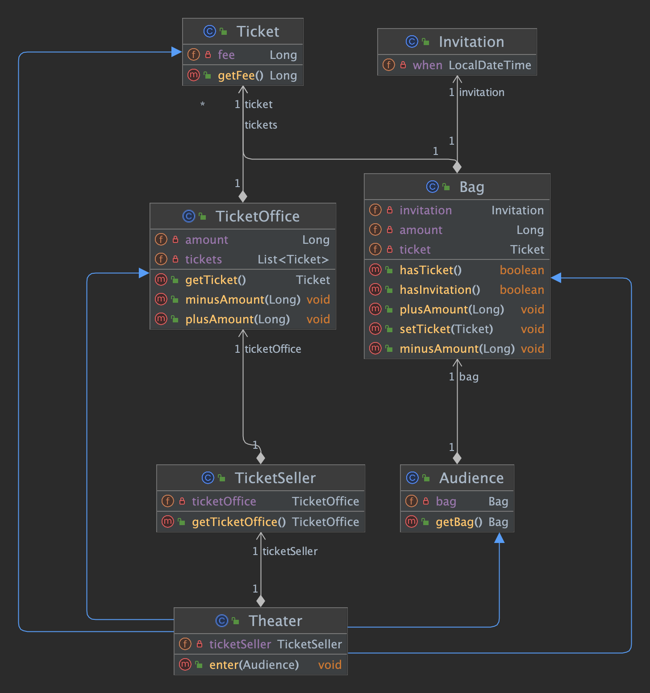

## Chapter 1. 객체, 설계
### 1. 티켓 판매 어플리케이션 구현하기
    소극장을 운영한다는 것을 가정하고 설계를 진행한다.
    초대권이 있는 관객과 초대권이 없는 관객의 입장 방식을 분리한다.
    AS-IS 코드로 확인할 수 있는 UML은 아래와 같다.

### 2. AS-IS 코드의 문제점.
 #### 로버트 마틴은 소프트웨어 모듈엔 세 가지 목적이 있다고 밝혔다.
    1. 제대로 동작하는 것
    2. 변경이 가능해야한다.
    3. 개발자가 쉽게 읽고 이해할 수 있어야 함.
 - 위와 같은 3 가지 모듈에 대한 관점에 비춰보았을 때 AS-IS 는 1. 과 같이 동작은 제대로 수행한다.
 - 단, 변경 용이성과 읽는 사람의 의사소통은 만족시키지 못함.
 - 그 이유는 Theater 클래스의 enter 메서드를 보면 쉽게 알 수 있다.
   - 소극장은 관람객의 가방을 열어 초대장이 들어 있는 지 살펴보고, 초대장이 들어있으면 판매원은 매표소에 보관돼 있는 티켓을 관람객의 가방으로 옮긴다.
   - 초대장이 없다면 관람객의 가방에서 티켓 금액만큼 현금을 꺼내어 매표소에 적립하고 매표소에 보관돼있는 티켓을 관람객의 가방에 옮긴다.
 - 이는 현실 세계와 크게 동떨어진 동작이다. (관람객과 티켓 판매원 모두 수동적인 존재로 극장 인스턴스가 직접 관람객의 가방을 열고 티켓 판매원이 줄 티켓을 가방에 넣는 등.)
 - 또한 Theater 클래스 자체가 Audience(Bag), TicketSeller(TicketOffice) 와 강결합돼 있어 변경에 취약하다. 
 - UML 상 파란 선은 간접적으로나마라도 의존하고 있음을 보여준다.

### 3. 설계 개선하기
 #### AS-IS의 코드가 이해하기 어려운 이유는 Theater 가 관람객의 가방과 판매원의 매표소에 직접 접근하기 떄문이다.
 - 이것은 관람객과 판매원이 자신의 일을 스스로 처리해야 한다는 우리의 직관을 벗어난다.
 - 관람객이 본인의 가방에서 현금과 초대장을 처리하고 판매원이 스스로 매표소의 티켓과 판매 요금을 다루도록 수정한다.
 - 즉, 관람객과 판매원을 자율적인 존재(책임을 가진)로 만들면 되는 것이다.
 - TO-BE 코드 역시 오류없이 정확하게 동작한다.
 - 추가로 Audience와 TicketSeller는 자신이 가지고 있는 소지품을 스스로 관리한다. 코드를 읽는 사람과의 의사소통이 개선되었다.
 - 또한 Audeicen와 TicketSeller의 내부 구현을 변경해도 Theater를 함꼐 변경할 필요가 없게되었다.
---
핵심은 
`각자의 객체가 자신의 문제를 스스로 해결하도록 코드를 변경한 것으로 인해 객체의 자율성을 높이는 방향으로 설계를 개선했다.`
